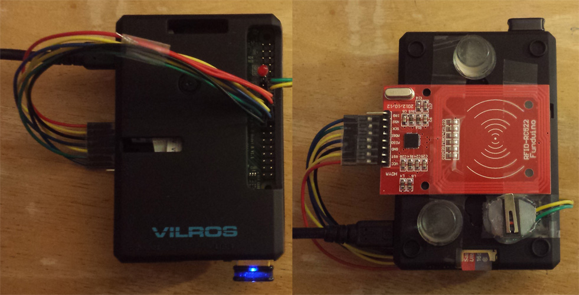

# RFID Indoor Task/Project Tracking System
## About
This project is a riff on option 4 [GPS DATA Server.](https://github.com/klavinslab/ee590/wiki/HW9) Since Google is already tracking my phone GPS location via their "Timeline" feature I decided to track location/activities inside my home. This project uses a Raspberry PI with a RFID tag reader and switch. When the Raspberry PI is placed on an RFID tag the PI logs the tag and uses the switch to time how long the PI is left there. Each of these tags is placed in a location in my house and corresponds to a task or activity. Periodically the PI uses Wi-Fi to send data to the server. A second Raspberry PI acts as a server on my home network and logs the data to a SQLite database, thus creating a simple time tracking system.  

### How the Code Works

#### Client:
1. A RFID tag in proximity triggers an event which logs the tag ID using the RC522 Module. An LED is blinked once to indicate a read.
1. The hardware is designed such that placing the PI on the RFID tag also depresses a switch.
  * The WiringPI module fires an interrupt when the switch changes state.
  * Then software debounce is applied by checking the time since the interrupt last fired.
  * The code then checks the switch state. If the switch is depressed a timer is started.
  * When the switch is released the duration is logged.
  * The code then checks that the switch was first depressed at relatively the same time as the RFID tag was detected. If this is true the event is logged to an array.
  * The elements of the array have the following structure:
  ```javascript
  { command: "put_rfid", device_id: STRING, rfid_tag_id: STRING, duration: NUMBER, date_time: NUMBER })
  ```
1. Finally an interval timer is set to periodically send the event log to the server.
  * First it checks that there is something to send
  * Then it calls connect for the hard coded port and server
1. Once the server connects:
  * A command to get all the data for that device is added.
  * A command to end the connection is also added.
  * Then the connection sends out the handshake command.
1. The code then relies on receiving responses from the server. On successful completion it clears it's logs of events.

#### Client to Server Connection:
A connection with the server should go as follows.
```javascript
// Client handshake:
{ "command": "ee590" }
// Server acknowledge:
{ "message": "Greetings" }
// Client send event:
{ command: "put_rfid", device_id: STRING, rfid_tag_id: STRING, duration: NUMBER, date_time: NUMBER }
// Server confirm log:
{ "result": "logged", "eventId": NUMBER }
// Client asks for logged event:
{ "command": "get_rfid", "device_id": STRING ,"eventID": NUMBER }
// Server sends requested event_id:
{ "result": "retrieved",
  "data": {"event_id": NUMBER, "date_time": NUMBER, "time_received": NUMBER, "duration": NUMBER,
          "device_id":STRING, "rfid_tag_id": STRING}
}
// Client checks data is correct with it's own logs.
// Client repeats send/confirm/check process for all events logged.
// Client reaches "get all" command and sends:
{ "command": "get_rfid", "device_id": STRING }
// Server responds with all events for that device:
{ "result": "all events",
"data": {
  "0": {"event_id": NUMBER, "date_time": NUMBER, "time_received": NUMBER, "duration":NUMBER,
        "device_id": STRING, "rfid_tag_id": STRING, "id": NUMBER},
  "1": {"event_id": NUMBER, "date_time": NUMBER, "time_received": NUMBER, "duration":NUMBER,
        "device_id": STRING, "rfid_tag_id": STRING, "id": NUMBER},
  "2": {"event_id": NUMBER, "date_time": NUMBER, "time_received": NUMBER, "duration":NUMBER,
        "device_id": STRING, "rfid_tag_id": STRING, "id": NUMBER},
  ...}
}
// Client then sends:
{ "command": "end" }
// Server confirms and ends connection
{ "message": "goodbye" }
```

#### Server:
* When connected it listens for connections and responds to commands after the handshake.
* Put RFID command:
  1. First the server checks that all the info is of the expected type
  1. Then the server records the current date/time
  1. A SQL query is run to determine the next event ID available.
  1. The current date/time and event ID are added to the sent data and inserted into the database
  1. A confirmation with the event ID is sent to the client
* Get command
  1. The server checks included info is of the expected type
  1. If an event ID is requested a query is run for this event and is returned to the client if found. If not an error message is sent.
  1. If no event ID requested a query is run for all events for that device ID.
  These events are added to a hash and returned to the client if found. If not an error message is sent.

####Database:
A script is included which builds a simple database for this system as shown below. This script includes six RFID tags with locations and descriptions.  

  

### Design Choices

**Server:**  
I already had a PI running as an IRC client at home. Since it is capable of running Node.js and Sqlite3 it made sense to use it for the server. The size and performance capabilities were also about right for a project like this. My home PC would be overpowered and there isn't a strong reason to use a AWS option, especially since it is logging personal information.

**Client:**
* Ideally this would be built with smaller and more power friendly hardware. However, with only a week to complete a PI with Wi-Fi and a battery pack was an option with a better chance for project completion.
* The Wiring PI module was chosen because it is one of the best GPIO libraries out there for the PI. It was one of the few libraries with interrupts and Node bindings. It also provides more setup options than other libraries such as setting pull-ups/down on pins and utility functions like delays.
* I choose to use RFID tags for tracking because they are one of the cheapest ways to log a unique ID. I do have a camera on the PI but it is a less reliable method and is overkill with the processing power needed. The RFID module was selected because it was one I had on hand. It happens to be a popular one in the hobbyist community and fortuitously there was npm packages for it. Unfortunately, it does not take advantage of the WiringPI SPI functions. In fact, all the RC522 libraries I found on npm were based on another GPIO library.  
  

**Code:**
* I choose to leave the RC522 asynchronous, rather than after a switch press was detected, because in the future I'd like to log events with no duration. These would be "checklist" type tasks versus the current time-based "activities"
* Currently the code uses the Device ID to return event info to the client. This is because the client is on Wi-Fi and the IP address is not static. Security for this should be looked into in the future.
* The code dumps the event log periodically. This was designed so that in the future the client can be taken away from the home Wi-Fi network. It needs more work to get there but it will log and save events until it can reach the server at a later point in time.
* The current connection to the server was designed to check the data logged correctly by requesting it back and comparing the values. Better ways of handling this should be investigated in the future.

### Evaluation of Results
During my use or the system I found it to work pretty well. The biggest problem is actually hardware. The switch force is more than the weight of the PI on it's own. A battery pack or a heavy book has to be used on top of the PI for the switch to correctly depress as it's placed on a tag.  

Reading an RFID tag and detecting a legitimate button press work really well. The RFID library is used as-is. The switch has a 100nF capacitor and software debounce applied.  

Once I established a working messaging system with the client checking each event is correctly inserted in the server's database, I saw no errors in communications between the client and server during the day I used the system.

One problem is when the client requests all it's own data. Once this becomes a large amount of data, the server hangs. Additionally, this function doesn't have a clear use in my product vision. Limiting this to perhaps the last 10 events or instead returning a summary of information might be more manageable and useful.

Functionally this system is much simpler to use than my normal time tracker, Toggl.com. Toggl has a better interface for viewing the data and entering new event/activity types. However, there is a lot of benefit in having a device that I don't have to wake and unlock before I can log.


### Future Development
This is a really simple proof-of-concept system at the moment. Ideally the client hardware would be smaller, cheaper, and have better battery life. The system is meant to be a base platform with which I can build more logging and data analytics into later.

**System:**
* Security for data transfer. At least have a non-guessable device ID.
* Improve process for confirming data transfer completed correctly.

**Server:**
* Set server to run on startup in case of power failure.
* Test SQLite database for limitations. e.g. get-all data will eventually be cumbersome to retrieve and send. This may need to be limited.
* Interface on server for:
  * Viewing data in a variety of ways.
  * Adding new RFID Tags.
    * RFID Tag Reader.
    * "Web Page" Interface for inputting data.
  * Add "goals" and compare to events logged.
* Collect other sources of data: Fitbit Steps, calories logged, etc.

**Client:**
* Save event log on client to a file in case of power failure.
* Have client handle the error if the server is not available.
* Have client handle error message from server from bad data input or not data to return on a "get".
* Replace client hardware with ESP Wi-Fi module or other cheap Wi-Fi system.  
Advantages: Low-Power mode between reads, compact, battery powered, C/C++.
* Build more clients:
  * PC can send use data.
  * Android can send GPS, App data.

## Installation Steps:
*If you do not have Raspberry PIs there is a demo included in the PC_Demo folder which mimics the Server/Client behavior without the RFID reader, LED, and switch. See "PC Demo" section below for instructions on running these.*

### Raspberry Pi Install
Please note these instructions are specific to the Raspberry PIs I had on hand. I've tried to note where instructions diverge based on OS/hardware.  
1. Update the Raspberry PIs:
  1. For the PIs that need to run Sqlite3 and NodeJS, Update: */etc/apt/sources.list* to "jessie" where there is "wheezy".  
  Alternatively: Make sure gcc is v4.8+
  1. Update and upgrade all packages and OS:  
  This will take a while.
  ```
  sudo apt-get update
  sudo apt-get upgrade
  sudo apt-get dist-upgrade
  sudo rpi-update
  sudo apt-get clean
  ```
  1. On all: Install [node-gyp](https://github.com/nodejs/node-gyp) to compile add-on modules `npm install -g node-gyp`  

1. PI Model A - Running Debian Wheezy - Acting as Server
  1. Install [Node.js](https://nodejs.org)  
  (This PI is an older version and requires downloading the correct node version manually, Arm v61 processor)
    ```
    wget https://nodejs.org/dist/v7.2.1/node-v7.2.1-linux-armv6l.tar.gz
    tar -xvf node-v7.2.1-linux-armv6l.tar.gz
    cd node-v4.0.0-linux-armv6l
    sudo cp -R * /usr/local/
    ```
    Check version `node -v`
  1. Install [Sqlite3](https://sqlite.org/) `sudo apt-get install sqlite3`
  1. Install [node-sqlite3](https://github.com/mapbox/node-sqlite3) module
    1. In project folder run `npm init` to create package.json
    1. In project folder install module: `npm install sqlite3`
  1. Load **RFIDserver.js** and **json_net.js** into the project folder.
    * Run `node create_rfid_event_table.js` to build tables in database
    * Run `node RFIDserver.js` to run server  

1. PI Model B - Running Debian Jessie - Acting as Client
  1. Install [Node.js](https://nodejs.org)  
  (Can add nodesource to source list and thus use apt-get because this PI is running Jessie on an Arm v71 processor)  
    ```
    curl -sL https://deb.nodesource.com/setup_6.x — Node.js v6 | sudo bas
    sudo apt-get install nodejs
    ```
  1. Turn off PI and wire RFID Reader, switch, and LED as shown. `sudo shutdown -h now`
    

  1. Install [NodeJS Raspberry PI RFID RC522 Reader](https://github.com/ocsacesar/rc522) module for RFID reader
    1. Ensure GCC is installed `sudo apt-get install build-essential`
    1. Install C GPIO Library for the Broadcom BCM2835 chip used on the PI
    ```
    wget http://www.airspayce.com/mikem/bcm2835/bcm2835-1.50.tar.gz
    tar -zxf bcm2835-1.50.tar.gz
    cd bcm2835-1.50
    ./configure
    make
    sudo make check
    sudo make install
    sudo modprobe spi_bcm2835
    ```
    Latest version can be found [here](http://www.airspayce.com/mikem/bcm2835/)
    1. In project folder run `npm init` to create package.json
    1. In project folder install module: `npm install --save rc522`
  1. Install [WiringPi](https://github.com/WiringPi/WiringPi-Node) module for general GPIO control.  
  In project folder install module:`npm install wiring-pi`
  1. Load **RFIDclient.js** and **json_net.js** into project folder `sudo node RFIDclient.js` to run.  
  Sudo is needed because SPI access is root only on the PI.

### Running on Raspberry PIs
**Client:** `sudo node RFIDclient.js` to run. Sudo is needed because SPI access is root only on the PI.  

**Server:**  
Run `node create_rfid_event_table.js` to build tables in database  
Run `node RFIDserver.js` to run server  

### PC Demo
This demo fakes tag readings at random times with randomly selected tags and durations. Please note, it is creating tags every 1 to 61 seconds but the duration is also random. Thus, events are overlapping. This is just to demonstrate communications between the server and the client.

**Server:**  
* Install Node.js on server PC
* Install sqlite3 package `npm install sqlite3`
* Run `node create_tables.js`
* Run `node Demoserver.js`  

**Client:**    
* Install Node.js on client PC
* Run `node Democlient.js 192.168.1.2 8080` (replace IP with that of your server)  

## Tests
I unfortunately ran out of time to extensively test my system. The testing I did do mostly involves just using the system. The data collected from this is included. Another semi-test is the PC Demo code which creates faux events on the client to send to the server. This just demonstrates the communication processes. I have included a list of tests I'd like to create to ensure quality of the system below.

**SQL:**  
The database included *tracker.db* is real data collected over the course of a few days. Included are several .sql files which can be run on the included sample database which demonstrate the various ways the data collected can be viewed.

**Future Tests:**  
*These tests outline what should be tested in the system as currently designed. Other tests would need to be added for future code features.*   
* Handling of switch timer reads without a RFID tag present.
* Handling of RFID tag reads without a switch toggle present.
* Client does not send when no messages present.
* Client server exchange ends with disconnect.
* Server throws correct errors on data that is incorrect per spec.
* Server requires handshake to begin all communications.
* Server does asynchronous calls in series when steps are dependent.
  * During data insert this is to create the next event ID.
  * During get all this is so that data isn't sent till all data is collected.
