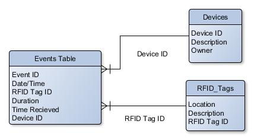
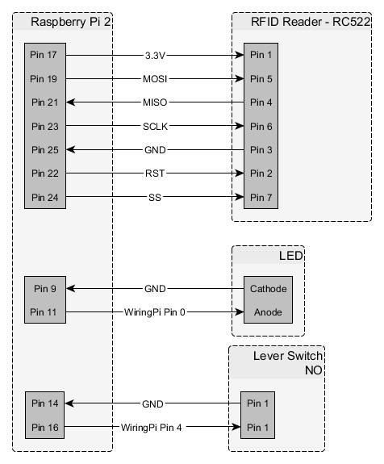

# RFID Indoor Task/Project Tracking System
## About
This project is a riff on option 4 [GPS DATA Server.](https://github.com/klavinslab/ee590/wiki/HW9) Since Google is already tracking my phone GPS location via their "Timeline" feature I decided to track location/activities inside my home. This project uses a Raspberry PI with a RFID tag reader and switch. When the Raspberry PI is placed on an RFID tag the PI logs the tag and uses the switch to time how long the PI is left there. Each of these tags is placed in a location in my house and corresponds to a task or activity. Periodically the PI uses WiFi to send data to the server. A second Raspberry PI acts as a server on my home network and logs the data to a SQLite database, thus creating a simple time tracking system.  

### How the Code Works

#### Client:
1. A RFID tag in proximity triggers an event which logs the tag ID using the RC522 Module. An LED is blinked once to indicate a read.
2. The hardware is designed such that placing the PI on the RFID tag also depresses a switch.
  * The WiringPI module fires an interrupt when the switch changes state.
  * Then software debounce is applied by checking the time since the interrupt last fired.
  * The code then checks the switch state. If the switch is depressed a timer is started.
  * When the switch is released the duration is logged.
  * The code then checks that the switch was first depressed at relatively the same time as the RFID tag was detected. If this is true the event is logged to an array.
  * The elements of the array have the following structure:
  ```javascript
  { command: "put_rfid", device_id: STRING, rfid_tag_id: STRING, duration: NUMBER, date_time: NUMBER })
  ```
3. Finally an interval timer is set to periodically send the event log to the server.
  * First it checks that there is something to send
  * Then it calls connect for the hard coded port and server
4. Once the server connects:
  * A command to get all the data for that device is added.
  * A command to end the connection is also added.
  * Then the connection sends out the handshake command.
5. The code then relies on receiving responses from the server. On successful completion it clears it's logs of events.

#### Client to Server Connection:
A connection with the server should go as follows.
```javascript
// Client handshake:
{ "command": "ee590" }
// Server acknowledge:
{ "message": "Greetings" }
// Client send event:
{ command: "put_rfid", device_id: STRING, rfid_tag_id: STRING, duration: NUMBER, date_time: NUMBER }
// Server confirm log:
{ "result": "logged", "eventId": NUMBER }
// Client asks for logged event:
{ "command": "get_rfid", "device_id": STRING ,"eventID": NUMBER }
// Server sends requested event_id:
{ "result": "retrieved",
  "data": {"event_id": NUMBER, "date_time": NUMBER, "time_received": NUMBER, "duration": NUMBER,
          "device_id":STRING, "rfid_tag_id": STRING}
}
// Client checks data is correct with it's own logs.
// Client repeats send/confirm process for all events logged.
// Client reaches "get all" command and sends:
{ "command": "get_rfid", "device_id": STRING }
// Server responds with all events for that device:
{ "result": "all events",
"data": {
  "0": {"event_id": NUMBER, "date_time": NUMBER, "time_received": NUMBER, "duration":NUMBER,
        "device_id": STRING, "rfid_tag_id": STRING, "id": NUMBER},
  "1": {"event_id": NUMBER, "date_time": NUMBER, "time_received": NUMBER, "duration":NUMBER,
        "device_id": STRING, "rfid_tag_id": STRING, "id": NUMBER},
  "2": {"event_id": NUMBER, "date_time": NUMBER, "time_received": NUMBER, "duration":NUMBER,
        "device_id": STRING, "rfid_tag_id": STRING, "id": NUMBER},
  ...}
}
// Client then sends:
{ "command": "end" }
// Server confirms and ends connection
{ "message": "goodbye" }
```

#### Server:
* When connected it listens for connections and responds to commands after the handshake.
* Put rfid command:
  1. First the server checks that all the info is of the expected type
  2. Then the server records the current date/time
  3. A SQL query is run to determine the next event ID available.
  4. The current date/time and event ID are added to the sent data and inserted into the database
  5. A confirmation with the event ID is sent to the client
* Get command
  1. The server checks included info is of the expected type
  2. If an event ID is requested a query is run for this event and is returned to the client if found. If not an error message is sent.
  3. If no event ID requested a query is run for all events for that device ID.
  These events are added to a hash and returned to the client if found. If not an error message is sent.

####Database:
A script is included which builds a simple database for this system as shown below. This script includes six RFID tags with locations and descriptions.
  

### Design Choices
why pis?
why various libs?
why rfid type?
note - "all data" based on device ID... this assumes that the ID is only known to the client.... in the future there prolly would be a handshake with password
(ip on my network can change with devices... )


### Evaluation of Results
how well your code accomplishes what you set out to do  

### Future Development
This is a really simple proof-of-concept system at the moment. Ideally the client hardware would be smaller, cheaper, and have better battery life. The system is meant to be a base platform with which I can build more logging and data analytics into later.

System:
* Security for data transfer. At least have a non-guessable device ID.
* Improve process for confirming data transfer completed correctly.

Server:
* Set server to run on startup in case of power failure.
* Interface on server for:
  * Viewing data in a variety of ways.
  * Adding new RFID Tags
    * RFID Tag Reader
    * "Web Page" Interface for inputting data
  * Add "goals" and compare to tasks/projects logged.
* New sources of data: Fitbit Steps, calories logged, etc

Client:
* Save event log on client to a file in case of power failure.
* Have client handle the error if the server is not available.
* Replace client hardware with ESP Wifi module or other cheap WiFi system.
    * Low-Power mode between reads
    * Compact
    * Battery Powered
    * C/C++
* More than one client.
  * PC can send use data
  * Android can send GPS or App data

## Installation Steps:
Please note these instructions are specific to the Raspberry PIs I had on hand. I've tried to note where instructions diverge based on OS/hardware.

1. Update the Raspberry PIs:
  1. For the PIs that need to run Sqlite3 and NodeJS, Update: */etc/apt/sources.list* to "jessie" where there is "wheezy".  
  Alternatively: Make sure gcc is v4.8+
  2. Update and upgrade all packages and OS:
  ```
  sudo apt-get update
  sudo apt-get upgrade
  sudo apt-get dist-upgrade
  sudo rpi-update
  sudo apt-get clean
  ```
  3. On all: Install [node-gyp](https://github.com/nodejs/node-gyp) to compile add-on modules `npm install -g node-gyp`

2. PI Model A - Running Debian Wheezy - Acting as Server
  1. Install [Node.js](https://nodejs.org)  
  (Wheezy is an older version and requires downloading the correct node version manually, Arm v61 processor)
    ```
    wget https://nodejs.org/dist/v7.2.1/node-v7.2.1-linux-armv6l.tar.gz
    tar -xvf node-v7.2.1-linux-armv6l.tar.gz
    cd node-v4.0.0-linux-armv6l
    sudo cp -R * /usr/local/
    ```
    Check version `node -v`
  2. Install [Sqlite3](https://sqlite.org/) `sudo apt-get install sqlite3`
  3. Install [node-sqlite3](https://github.com/mapbox/node-sqlite3) module
    1. In project folder run `npm init` to create package.json
    2. In project folder install module: `npm install sqlite3`
  4. Load RFIDserver.js into the project folder.
    * Run `sqlite3 tracker.db` to create database
    * Run `node create_rfid_event_table.js` to build tables in database
    * Run `node RFIDserver.js` to run server

3. PI Model B - Running Debian Jessie - Acting as Client
  1. Install [Node.js](https://nodejs.org)  
  (Can add nodesource to source list and thus use apt-get because this PI is running Jessie on an Arm v71 processor)  
    ```
    curl -sL https://deb.nodesource.com/setup_6.x — Node.js v6 | sudo bas
    sudo apt-get install nodejs
    ```
  2. Install [NodeJS Raspberry PI RFID RC522 Reader](https://github.com/ocsacesar/rc522) module for RFID reader
    1. Turn off Pi and wire RFID Reader as shown   
    
    2. Ensure GCC is installed `sudo apt-get install build-essential`
    3. Install C GPIO Library for the Broadcom BCM 2835chip used on the PI
    ```
    wget http://www.airspayce.com/mikem/bcm2835/bcm2835-1.50.tar.gz
    tar -zxf bcm2835-1.50.tar.gz
    cd bcm2835-1.50
    ./configure
    make
    sudo make check
    sudo make install
    sudo modprobe spi_bcm2835
    ```
    Latest version can be found [here](http://www.airspayce.com/mikem/bcm2835/)
    4. In project folder run `npm init` to create package.json
    5. In project folder install module: `npm install --save rc522`
  3. Install [WiringPi](https://github.com/WiringPi/WiringPi-Node) module for general GPIO control.  
  In project folder install module:`npm install wiring-pi`
  4. Load RFIDclient.js into project folder `sudo node RFIDclient.js` to run
  sudo is needed because SPI access is root only on the PI.


## Running

## Notes on Running

## Tests
* Client to Server interactions faked?
* IRL tests?
